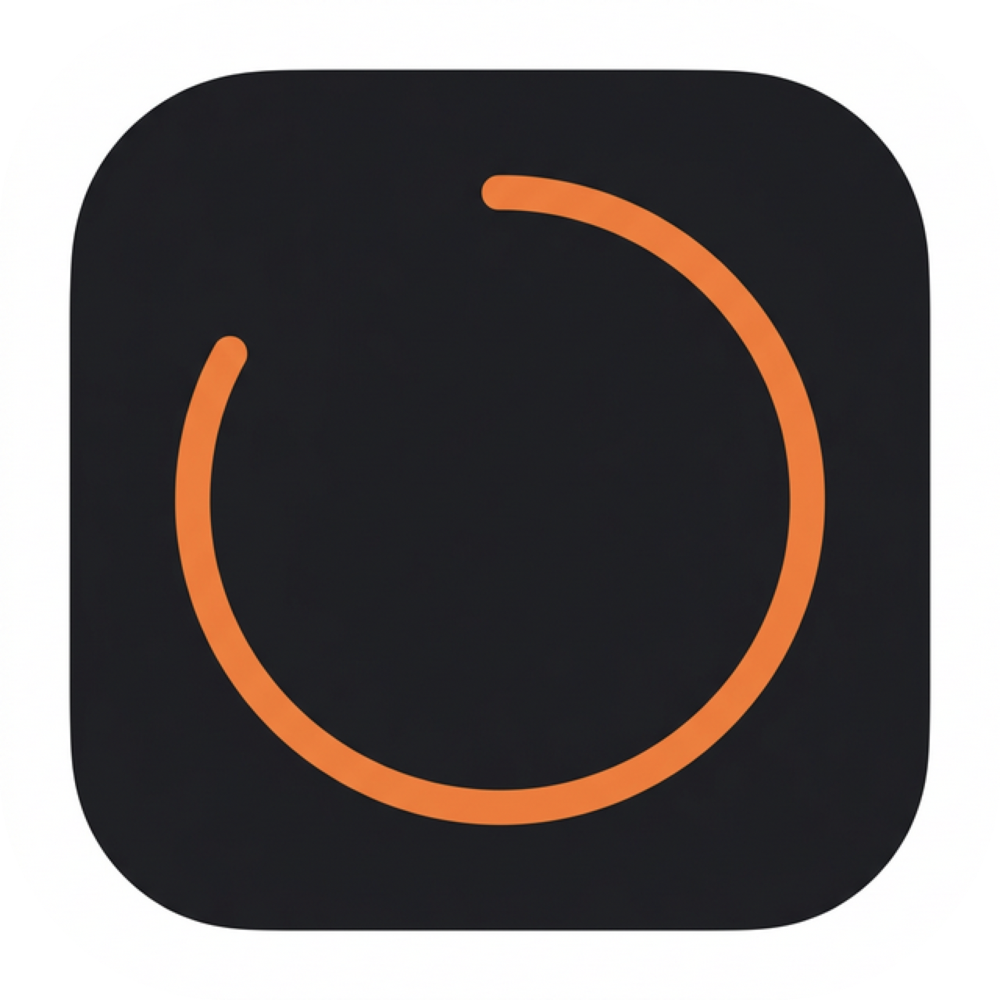
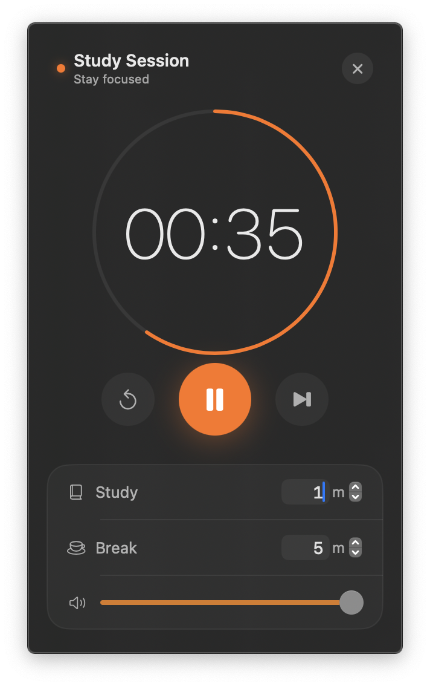
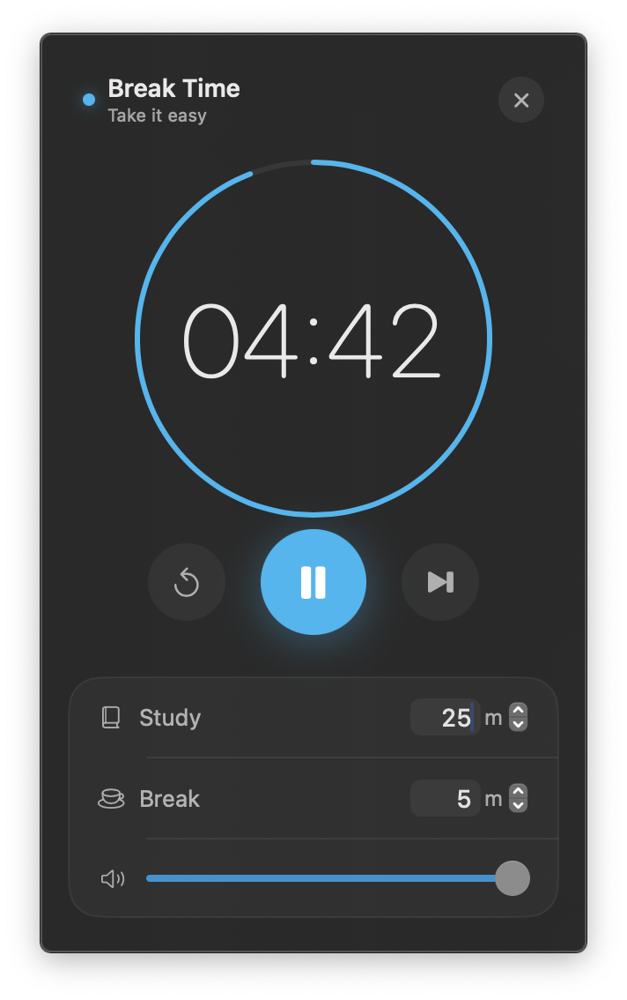

<div align="center">
  
  <h1>Absolutely Free Pomodoro Timer for macOS</h1>
  <p>A minimal, un-intrusive menu bar application designed for deep focus.</p>
</div>

---

## Overview

Pomodoro is a completely free, lightweight focus timer that lives directly in your macOS menu bar. There are no subscriptions, no ads, and no complicated setups. It stays out of your way while providing the essential structure you need to maintain productivity and prevent burnout.

Click the menu bar icon to start a session, take your break when the alarm fires, and repeat. The current remaining time and session type are always visible at a glance without needing to open the app or switch windows.

<p align="center">
  
  &nbsp;
  
</p>

## System Requirements

- **OS:** macOS 14.0 (Sonoma) or later
- **Environment:** Xcode 15+ or Swift 5.9+ (for building from source)

## Installation 

### Option 1: Homebrew (Recommended)
You can install the app easily via Homebrew by adding the custom tap:

```bash
brew tap JYS1025/pomodoro
brew install --cask pomodoro
```

### Option 2: Build From Source
If you prefer to compile the application yourself:

```bash
git clone https://github.com/JYS1025/pomodoro.git
cd pomodoro
sh build.sh
cp -r build/Pomodoro.app /Applications/
```

## Internal Architecture

The project strictly follows Apple's Human Interface Guidelines, prioritizing clarity and depth.

```text
Pomodoro/
└── Sources/
    ├── PomodoroApp.swift       # Application entry point and MenuBarExtra configuration
    ├── TimerView.swift         # Declarative SwiftUI presentation layer
    └── TimerViewModel.swift    # Core timer state machine, system audio, and notifications
```
